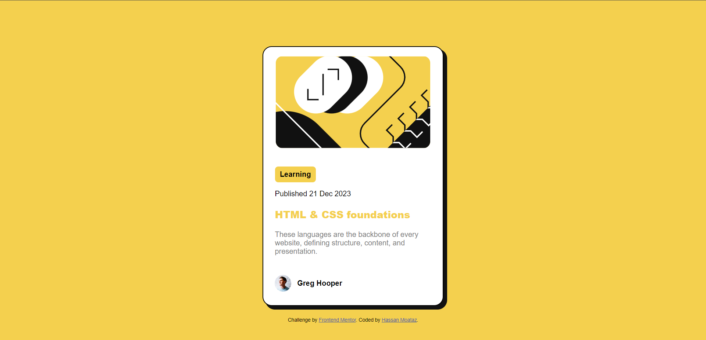

# Frontend Mentor - Blog preview card solution

This is a solution to the [Blog preview card challenge on Frontend Mentor](https://www.frontendmentor.io/challenges/blog-preview-card-ckPaj01IcS). Frontend Mentor challenges help you improve your coding skills by building realistic projects. 

## Table of contents

 - [Overview](#overview)
  - [The challenge](#the-challenge)
  - [Screenshot](#screenshot)
  - [Links](#links)
  - [Built with](#built-with)
  - [What I learned](#what-i-learned)
  - [Continued development](#continued-development)
  - [Useful resources](#useful-resources)
  - [Author](#author))

## Overview

- Front-End Mentor Blog preview card solution by Hassan Moataz.

### The challenge

Users should be able to:

- See hover and focus states for all interactive elements on the page

### Screenshot

### Links

- Solution URL: ()
- Live Site URL: ()

### Built with

- Semantic HTML5 markup
- CSS custom properties
- Flexbox

### What I learned

I've had a hard time figuring out the suitable css properties for this challenge, also how to make it fully responsive but as i completed it, it gived me motivation to pursue more Front-end challenges as it sharpens my skills while doing it!

body {
    background-color: var(--Yellow-background);
    font-family: var(--ff) ;
    text-align: center;
    display: flex;
    justify-content: center;
    align-items: center;
    flex-direction: column;
    margin: 0;
    padding: 0;
    width: 100%;
    height: 100%;
}

/*main-card*/
.card {
    background-color: var(--White-card);
    border: 1.75px solid black;
    border-radius: 20px;
    box-shadow: 7px 7px 0 1px var(--Black-text);
    margin: 100px;
    margin-bottom: 25px;
    max-width: 390px;
    height: auto;
}

### Continued development

- I want to learn more about css by creating multi-page websites

### Useful resources

-(https://www.w3schools.com) - W3S helped me remember some concepts i forgot during the project

## Author

- Frontend Mentor - [@hassanmoaa](https://www.frontendmentor.io/profile/hassanmoaa)